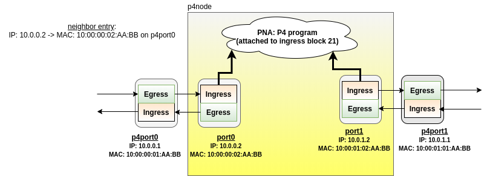

# Dependency

1) The descriptions assume you are running these sample progs using the vagrant
machines from here:
https://github.com/p4tc-dev/p4tc-tutorial-pub

2) Currently using simple traffic generator from here:
https://github.com/ebiken/sendpacket

# Topology

Run the build-simple-p4 script to build the topology as illustrated below.

# Examples

cd to each example and read the approriate READMEs.
